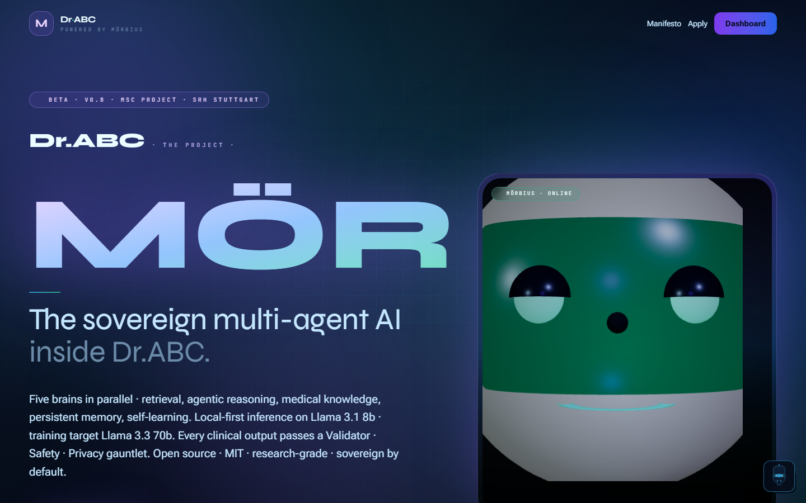
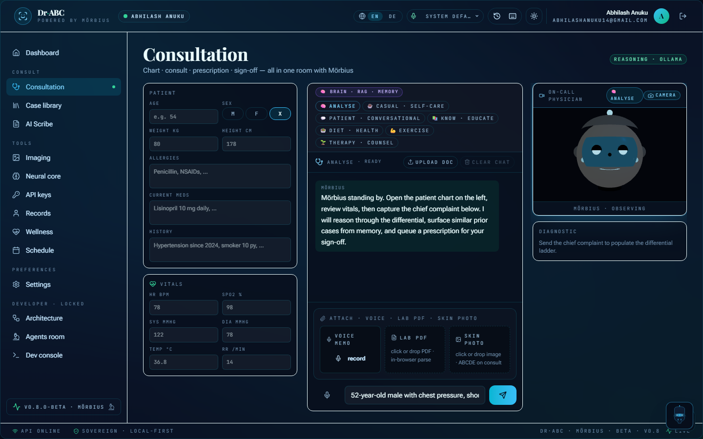
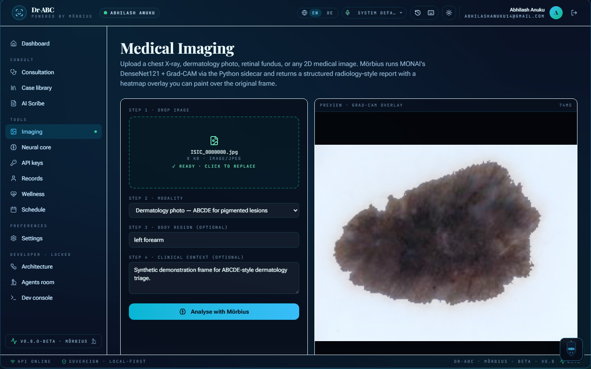
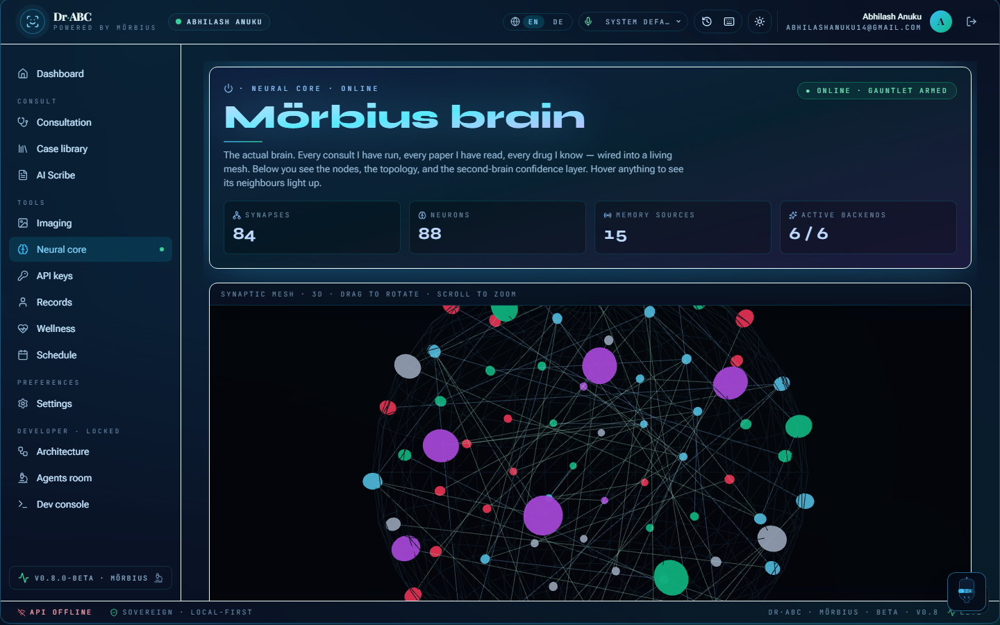
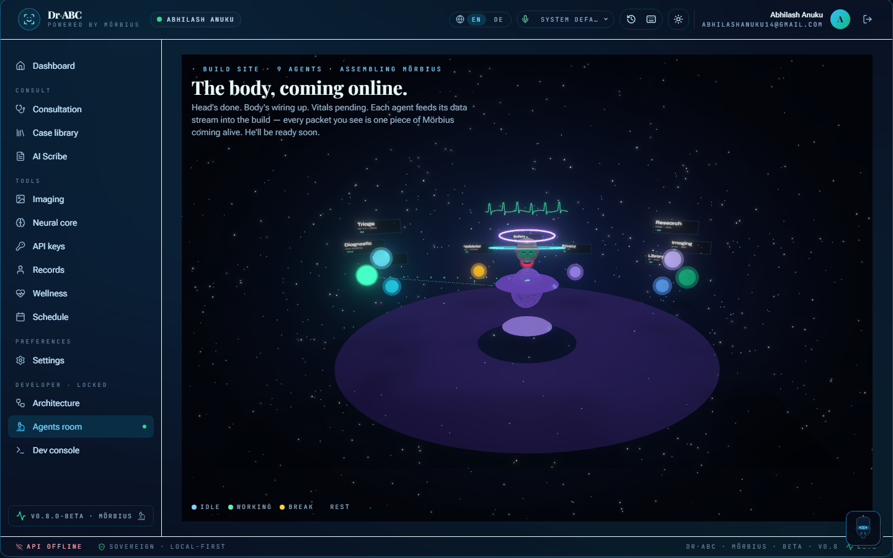

<div align="center">

# Dr·ABC

### A multi-agent **medical chat assistant** — powered by **Mörbius** · local-first · self-correcting · built at $0/month.

[](https://bun.sh)
[](https://www.typescriptlang.org/)
[](https://react.dev)
[](https://tailwindcss.com)
[](https://hono.dev)
[](./AGENTS.md)
[](#)
[](#)

**Built for the MSc Applied Artificial Intelligence module · SRH University Stuttgart · K-2472-2200**

</div>

---

## Project context

| Field | Value |
| --- | --- |
| **Built for** | MSc Applied Artificial Intelligence module · SRH University Stuttgart · K-2472-2200 |
| **Author** | Abhilash Anuku · [abhilashanuku14@gmail.com](mailto:abhilashanuku14@gmail.com) |
| **Co-author** | Simranjot Kaur |
| **Release** | `v1.0.18` |
| **Repository** | [github.com/AbhilashAnuku/Dr.ABC](https://github.com/AbhilashAnuku/Dr.ABC) |

---

## What Dr·ABC is

A **multi-agent medical chat assistant**. Instead of one large model answering everything, Dr·ABC routes each consult through **nine single-responsibility agents** wired together by a streaming orchestrator and grounded in a typed medical knowledge graph. **Mörbius** is the engine that makes it run.

Every answer passes through a Secure Pass gauntlet: the **Validator** gate runs today, with **Safety** and **Privacy** gates scaffolded next. Every gate failure becomes a bounded residual on the next inference (boosting-inspired residual correction), so the system learns from each correction.



> **Note:** Built for an MSc Applied AI module as an engineering study. It is **not a medical device and not for clinical use** — all clinical cases are fictional and no real patient data is used. Crisis language routes to a real helpline (Samaritans 116 123 · 988 US · 112 EU).

## See it

| | |
| :---: | :---: |
|  |  |
| **Consultation** — chart, differential, prescription, sign-off | **Imaging** — dermatology / X-ray analysis with overlays |
|  |  |
| **Knowledge core** — the medical knowledge graph, live | **Agents room** — the nine specialists, visualised |

## Five-pillar brain

1. **Retrieval (RAG)** — Library agent fronted by `PgVectorRetriever` (Postgres + pgvector) with BM25 fallback
2. **Agentic reasoning** — 9 specialist agents sharing `BaseAgent<TPayload, TData>`
3. **Medical knowledge** — typed graph at `docs/status/medical-graph.json`, 88 nodes / 84 edges, grows on every research-cycle
4. **Memory** — per-user IndexedDB (`apps/web/src/lib/morbius-memory.ts`), Postgres-mirror for cross-device resume
5. **Self-learning** — boosting journal · deterministic refiner · meta-agent that proposes specialty-prompt tunes

## Tools + tech stack

| Layer | Choice | Why |
| --- | --- | --- |
| **Runtime** | Bun 1.3 | Replaces Node + npm + ts-node + tsx |
| **Language** | TypeScript strict | `verbatimModuleSyntax`, `noUncheckedIndexedAccess` |
| **Monorepo** | Bun workspaces | `apps/*` + `packages/*`, 8 workspaces |
| **Lint + format** | Biome | Replaces ESLint + Prettier |
| **API** | Hono | SSE streaming, edge-ready, Bun-native |
| **Frontend** | React 19 + Vite 6 | Concurrent features, ~140 KB initial bundle |
| **Style** | Tailwind v4 + Roboto Flex | Clean, readable typography |
| **Components** | shadcn/ui via `@dr-abc/ui` | Card · Button · PulseDot · cn() |
| **ORM** | Drizzle | Type-safe, FHIR R4 schema |
| **DB** | PostgreSQL + pgvector | Activity sink, audit log, vector retrieval |
| **Cache + queue** | Redis Streams | Inter-agent task queue |
| **Vector index** | Qdrant | RAG over medical corpora |
| **Local LLM** | Ollama (`llama3.1:8b` default · `llama3.3:70b-instruct-q4_K_M` on 64 GB+) | Local-first cascade primary |
| **Cloud LLMs** | NVIDIA NIM (Llama-3.3-70B · free 1k credits/mo) · HuggingFace OpenBioLLM-8B · Anthropic Sonnet 4.6 (paid emergency fallback) | Cascade fallbacks in priority order |
| **Imaging CV** | Roboflow (RF-DETR workflow) → py-svc MONAI DenseNet121 + Grad-CAM → hosted vision fallback | Three-backend cascade |
| **Object detection** | YOLO11 (Ultralytics 2024 · variants n/s/m/l/x) | Lesion + fracture + ECG annotation; Roboflow hosts the model |
| **Translation** | MarianMT via py-svc sidecar | EN / DE locale parity |
| **Speech** | Web Speech API (browser-native) | No audio leaves the device |
| **Imaging sidecar** | FastAPI + MONAI + MedSAM | `apps/py-svc/`, Docker-Compose-ed |
| **3D + AR** | Three.js + R3F + WebXR + Capacitor | Mobile path via Capacitor; AR overlay v1.4+ |
| **Auth** | argon2id via `Bun.password` + Postgres-backed sessions + Google OAuth | argon2id + Postgres-backed sessions |
| **MCP toolbelt** | Chrome MCP · Perplexity · Firecrawl · Playwright · Roboflow + Glif | Composed where the failure mode is bounded |
| **Observability** | OpenTelemetry + Grafana | Trace every agent call |
| **CI / Deploy** | GitHub Actions · Vercel hobby tier · Netlify · Fly.io (Hono API) | Free-tier global deploy |

## Live state of the build

Honest status — numbers come from local runs you can reproduce:

| Metric | Value | Notes |
| --- | --- | --- |
| Tests | 615 / 620 pass | `bun test` · the 5 diagnostic tests assume a local Ollama (local-first) |
| Lint | Biome clean | `bun run lint` |
| Typecheck | web app clean | `bun run typecheck` · known type drift in the `db` seed script + a `tsconfig` node-types gap (tracked, see [Known limitations](#known-limitations)) |
| MedQA-USMLE-200 cascade | 74.5 % | benchmark sample · `docs/status/medqa-usmle200-cascade-2026-05-03.json` |
| MedMCQA-100 cascade | 74.0 % | benchmark sample · `docs/status/medqa-medmcqa100-cascade-2026-05-03.json` |
| 15-case Secure-Pass rate | 100 % | `docs/status/accuracy-2026-05-12.json` |
| Knowledge-graph nodes | 88 (84 edges) | `docs/status/medical-graph.json` |
| Diagnostic backend | Ollama (local-first) · NVIDIA NIM / HF / Anthropic fallbacks | `/health.diagnosticBackend` |

### Known limitations

This is a learning-focused build, and it's honest about its rough edges:

- **Typecheck is not fully green.** The web app typechecks clean, but the `db` seed script references three tables that drifted out of `schema.ts`, and the root `tsconfig` `types` array omits `node`, so one `child_process` call mis-types. Both are tracked, neither affects the running app.
- **Five tests need a local Ollama.** The local-first diagnostic agent returns `null` when no Ollama is reachable, so 5 of 620 tests fail in a clean room. They pass against a running Ollama.
- **Benchmarks are small samples**, run locally — a measure of direction, not clinical accuracy.

## Get it running locally

```bash
# 1. Install
bun install

# 2. Bring up Postgres + Redis + Qdrant + Ollama (Docker)
bun run infra:up

# 3. Start everything (api + web + py-svc)
bun run dev

# 4. Or piece by piece
bun run dev:api    # Hono SSE server on :8787
bun run dev:web    # Vite on :5173
bun run dev:py     # FastAPI MONAI sidecar on :8001
```

The API loads `.env` via `bun --env-file=../../.env`. Pin a diagnostic backend at runtime without an `.env` edit:

```bash
curl -X POST http://localhost:8787/dev/env-keys \
  -H "Content-Type: application/json" \
  -H "X-Dr-Abc-Role: developer" \
  -d '{"MORBIUS_BACKEND":"nvidia","BACKEND_PRIORITY":"nvidia,huggingface,ollama"}'
```

## Continuous learning (overnight)

```bash
# Every 30 minutes — accuracy + MedQA harnesses, tuner, meta-agent
bun run morbius:autopilot --interval 30m --tune

# Once-off cycles
bun run morbius:accuracy
bun run morbius:medqa
bun run morbius:persona
bun run morbius:meta          # meta-agent: Mörbius proposes its own training agents · deterministic scoring
bun run morbius:promote-tunes # architect-gated promotion of queued specialty-prompt diffs
```

## Deploy

The **landing page** is published on every push to `main` via Vercel (`vercel.json`) or Netlify (`netlify.toml`). Both configs build the web app and rewrite `/api/*` to the Fly.io-hosted API. Auth-gated `/app/*` routes stay private behind the live session cookie.

Build locally to verify before push:

```bash
bun run --filter @dr-abc/web build
# Output: apps/web/dist/
```

## Subscribe for updates

The landing page has an email-subscribe block at the bottom. When a visitor submits, their default mail client opens with a pre-filled welcome draft to the admin inbox; the email is also mirrored to `localStorage:dr-abc:subscribers` so the architect can export the list from the browser console. Real-mail-sync to a DB row lands once the admin panel ships.

## Standing rules (excerpt)

- **Local-first** by default. `DEFAULT_BACKEND_PRIORITY = ['ollama','nvidia','huggingface']` in `packages/agents/src/diagnostic.ts`. Reordering requires an ADR.
- **No PHI** in repo. The 15 seeded cases at the seeded cases in `packages/db/src/seed.ts` are explicitly fictional.
- **No kill, no sorry.** Every refusal stays inside the persona. Crisis language routes to Samaritans / 988 / 112.
- **Warm-doctor tone, always.** Five tones via `packages/agents/src/tone.ts`: clinical · empathetic · reassuring · conversational · delivering-hard-news.
- **Tunes are architect-approved** — `bun run morbius:promote-tunes` is the single gatekeeper.
- **No delete without ask** — files, DB rows, JSON snapshots may not be deleted without explicit approval; renames count as deletes.
- **Single-author commits** — every commit authored by `Abhilash Anuku <abhilashanuku14@gmail.com>`; no co-author trailers in any commit message.

Full standing-rules surface is in [AGENTS.md](./AGENTS.md).

## Documentation

| Doc | Purpose |
| --- | --- |
| [packages/morbius-core/](./packages/morbius-core/) | The Mörbius engine — orchestrator, agents, registry |
| [CHANGELOG.md](./CHANGELOG.md) | Versioned history |
| [AGENTS.md](./AGENTS.md) | Standing engineering rules |

## Authors

- **Lead author:** Abhilash Anuku ([abhilashanuku14@gmail.com](mailto:abhilashanuku14@gmail.com)) — system architecture, implementation, evaluation harness, documentation.
- **Co-architect:** Simranjot Kaur — clinical review, cross-team comparison study, slide deck.

SRH University Stuttgart · MSc Applied Artificial Intelligence · Subject K-2472.

## Safety + license

⚠ **Not a clinical decision support tool.** AI-generated reports are not a diagnosis. Verify findings with a clinician before acting. Crisis language inside Mörbius routes to a real helpline (Samaritans 116 123 · 988 US · 112 EU).

License: see [LICENSE](./LICENSE).

---

<div align="center">

Built at SRH University Stuttgart · MSc Applied Artificial Intelligence · K-2472-2200 · 2026

</div>
